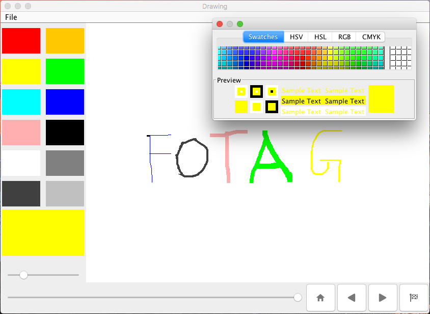

# Doodle:

	Doodle is a board that user can draw 2-d graphs on with mutiple colors and different levels of thickness. A slider in the bottom of the application keeps track of every proccess that user draws on the board. User can also replay the drawing process by click on the forward play button and backward play button.

## User Interface:
	1.Color buttons: user can click on the existed color button to change the current color same as the color button
	2.Current Color and color picker: the large color button refects the current color the user is using. 
					  By clicking on it, there will prompt a color chooser to have way more colors to pick.
	3.Thickness slider: by sliding the slider, user can change the line thickness from thin to thick
	4.Movement slider: by sliding the slider, user can go to the process that want to be
	5.Play button: Play the animation from start to end
	6.Backward Play button: Play the animation form end to start
	7.Start button: go to the starting point
	8.End button: go to the ending point

## Enhancement:
	1.When the canvas resizes to fit the available space, it maintains its aspect ratio (i.e. it can only be resized equally in both directions). The canvas is not cut off during resizing (5%).
	2.Accurate representation of time. It should take an amount of time to play back a stroke that is proportional to how long it took to draw, and the tick-marks on the playback bar should be spaced appropriately. (10%)
	3.Ability to play animations both forward and backward (5 marks).
	4.Dynamic use of widgets; if display gets too small, perhaps pull a subset of widgets out of application view to support more compressed presentation of options, e.g. replace stroke width with combo box, color palette with subset of buttons (5 or more depending on extent).
	5.Undockable toolbars to create floating palettes (10 marks).
	
## Screen shots

